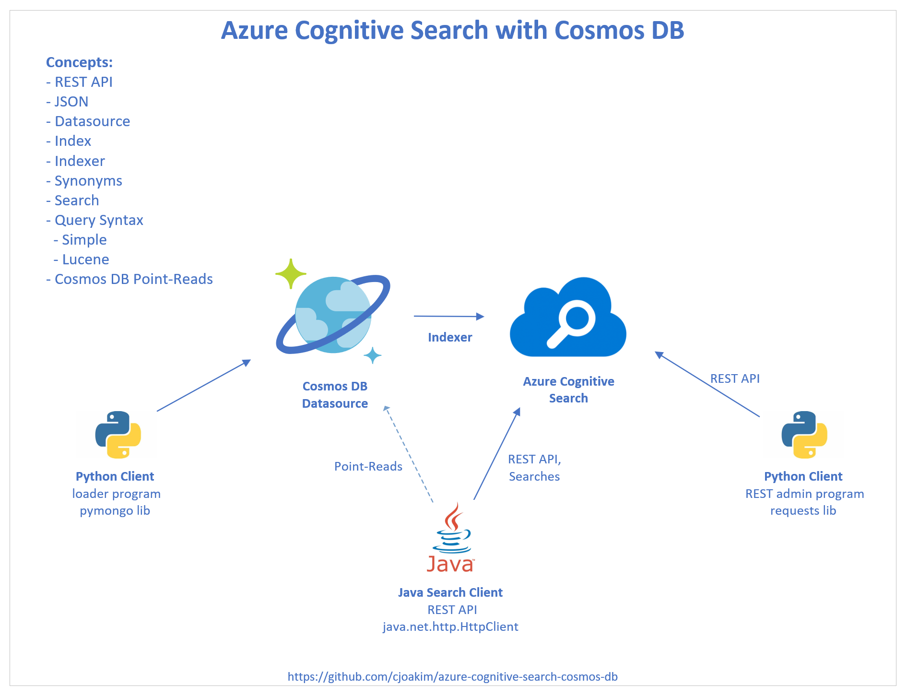

# azure-cognitive-search-cosmos-db

Examples of using **Azure Cognitive Search (ACS)** with **Azure Cosmos DB**,
focusing on the **Mongo API**.

The documentation here focuses on Windows PowerShell and *.ps1 scripts, but
corresponding bash shell scripts for macOS and Linux are also in this repo.

See the Microsoft documentation here:
https://learn.microsoft.com/en-us/azure/search/search-howto-index-cosmosdb-mongodb

See my previous my repo with Azure Cognitive Search **with Azure Cognitive Services** here:
https://github.com/cjoakim/azure-cognitive-search-example

--- 

## Architecture

There are three common ways to populate Azure Cognitive Search from Cosmos DB:

- Use an **Indexer in ACS** to populate an **Index** from a Cosmos DB **Datasource**
- Directly populate ACS via the Cosmos DB Change Feed, Azure Function, and ACS REST API
- **Application DAO code** which updates both Cosmos DB and ACS REST API

**This repo focuses on the Indexer solution, which is the most common with our customers.**

<p align="center">
    
</p>

---

## Project Directory Structure

This repo contains the following three subdirectories/subprojects with working code:

```
.                     <-- Root directory of this repo
├── java_acs_client   <-- Java client app for the indexed data in Azure Cognitive Services
├── py_acs_admin      <-- Python console app for configuring/administering Azure Cognitive Services
└── py_cosmos_data    <-- Python console app to wrangle the raw data and load it to Cosmos DB Mongo API
```


There are several **tmp/** directories used in this repo, and these are intentionally git-ignored.
You can create these tmp directories with **create_tmp_dirs.ps1** or **create_tmp_dirs.sh**.

---

## System Requirements 

### Software 

- git
- Python 3+ (project developed with Python 3.11.1)
- Java 11+ (project developed with openjdk version "11.0.16.1" 2022-08-12 LTS )
- Gradle 7.4+ (project developed with Gradle 7.4.2)

### Azure PaaS Services

- Azure Cognitive Search
- Azure Cosmos DB with Mongo API
- Network access to both of the above accounts

### Environment Variables with example values

This repo uses the following **environment variables**.  Be sure to set these
exact environment variable **names** but with **your values** per your
Azure Cosmos DB database and Azure Cognitive Search Account.

```
AZURE_SEARCH_NAME=gbbcjsearch
AZURE_SEARCH_URL=https://gbbcjsearch.search.windows.net
AZURE_SEARCH_ADMIN_KEY=<secret>
AZURE_SEARCH_QUERY_KEY=<secret>

AZURE_COSMOSDB_MONGODB_CONN_STRING=mongodb://gbbcjmongo:<secret>@gbbcjmongo.mongo.cosmos.azure.com:10255/?ssl=true&replicaSet=globaldb&retrywrites=false&maxIdleTimeMS=120000&appName=@gbbcjmongo

AZURE_COSMOSDB_NOSQL_ACCT=gbbcjcdbnosql
AZURE_COSMOSDB_NOSQL_RO_KEY1=<secret-read-only-key>
```

For the Cosmos DB Mongo API demonstration the AZURE_COSMOSDB_NOSQL_* environment variables
aren't needed.

---

## Wrangling data, and loading it to Cosmos DB

This is implemented in the **py_cosmos_data** subproject with Python 3.

The sample data comes from [Openflights](https://openflights.org/data.html)
and includes **airports** and **routes**.

You don't have to "wrangle" this data, as the data that is loaded to Cosmos DB
are these two json files already in the repo:

```
py_cosmos_data/data/openflights/json/enhanced_airports.json
py_cosmos_data/data/openflights/json/enhanced_routes.json
```

### Provisioning Cosmos DB 

Create two containers in your Cosmos DB account - **airports** and **routes**
with a **dev** database.  Both should have the **partition key 'pk'**. 
Autoscale 4000 Request Units (RU) at the database level is recommended. 

### Loading Cosmos DB

First, create the Python virtual environment:

```
.\venv.ps1
```

Then load Cosmos DB with the above data files,
then count the documents in each container.

```
python main.py load_airport_data dev airports
python main.py load_route_data dev routes

python main.py count_docs dev airports
python main.py count_docs dev routes
```

### Example Documents

The **airport** documents are smaller, simpler, flatter documents.
while the **route** documents are larger with nested fields and arrays.

#### Airport

```
  {
    "airport_id": 3876,
    "name": "Charlotte Douglas International Airport",
    "city": "Charlotte",
    "country": "United States",
    "iata": "CLT",
    "icao": "KCLT",
    "latitude": 35.2140007019043,
    "longitude": -80.94309997558594,
    "altitude": 748.0,
    "tz_offset": -5.0,
    "dst": "A",
    "tz": "America/New_York",
    "type": "airport",
    "source": "OurAirports",
    "pk": "CLT"
  }
```

#### Route 

```
  {
    "airline": "AA",
    "airline_id": "24",
    "pk": "MIA:GIG",
    "source_airport": {
      "airport_id": 3576,
      "name": "Miami International Airport",
      "city": "Miami",
      "country": "United States",
      "iata": "MIA",
      "icao": "KMIA",
      "latitude": 25.79319953918457,
      "longitude": -80.29060363769531,
      "altitude": 8.0,
      "tz_offset": -5.0,
      "dst": "A",
      "tz": "America/New_York",
      "type": "airport",
      "source": "OurAirports",
      "pk": "MIA"
    },
    "source_airport_id": "3576",
    "dest_airport": {
      "airport_id": 2560,
      "name": "Rio Gale\u00e3o \u2013 Tom Jobim International Airport",
      "city": "Rio De Janeiro",
      "country": "Brazil",
      "iata": "GIG",
      "icao": "SBGL",
      "latitude": -22.8099994659,
      "longitude": -43.2505569458,
      "altitude": 28.0,
      "tz_offset": -3.0,
      "dst": "S",
      "tz": "America/Sao_Paulo",
      "type": "airport",
      "source": "OurAirports",
      "pk": "GIG"
    },
    "dest_airport_id": "2560",
    "codeshare": "",
    "stops": "0",
    "equipment": "763",
    "source_iata": "MIA",
    "dest_iata": "GIG",
    "frequent_passengers": [
      "Mark Mcclure",
      "Denise Cummings",
      "Melissa Davis"
    ]
  }
```

---

## Administering and Configuring Azure Cognitive Search

This is implemented in the **py_acs_admin** subproject with Python 3
and the very nice **REST API** exposed by the Azure Cognitive Search service.

Alternatively, you can manually configure ACS in **Azure Portal** or 
with automation using PowerShell, Bicep, az CLI, or Terraform.

I chose the REST API for this repo because it is very full-featured, easy to use,
and actual searches from your application code typically use the REST API, too.

### Key Concepts

- **REST HTTP API**
- **Datasource** - Points ACS to a source of the data to be indexed
- **Index** - defines the attributes of the searched/indexed data
- **Indexer** - ties a datasource to an index, with a schedule
- **Synomyn** - lists of similar words for searching with
- **JSON representation of these concepts** - see below
- **Query Syntax - Simple or Lucene**
- **The optional "Cognitive" part with Azure Cognitive Services**
  - document cracking, keyword and sentiment analysis, image processing, etc

#### Example Datasource

This example points to a Cosmos DB Mongo API account, dev database, routes collection.

```
  {
    "name": "cosmosdb-mongo-dev-routes",
    "type": "cosmosdb",
    "credentials": {
      "connectionString": "AccountEndpoint=https://gbbcjmongo.documents.azure.com;AccountKey=<secret>;Database=dev;ApiKind=MongoDb;"
    },
    "container": {
      "name": "routes",
      "query": null
    },
    "dataChangeDetectionPolicy": {
      "@odata.type": "#Microsoft.Azure.Search.HighWaterMarkChangeDetectionPolicy",
      "highWaterMarkColumnName": "_ts"
    },
    "dataDeletionDetectionPolicy": null,
    "encryptionKey": null,
    "identity": null
  }
```

#### Example Index

Note that **doc_id** corresponds to the **_id** attribute.

```
  {
    "name": "mongo-routes",
    "fields": [
      {
        "name": "id",
        "key": "true",
        "type": "Edm.String",
        "searchable": "true",
        "filterable": "true",
        "sortable": "true",
        "facetable": "true"
      },
      {
        "name": "doc_id",
        "key": "false",
        "type": "Edm.String",
        "searchable": "true",
        "filterable": "true",
        "sortable": "true",
        "facetable": "true"
      },
      {
        "name": "pk",
        "type": "Edm.String",
        "key": "false",
        "searchable": "true",
        "filterable": "true",
        "sortable": "true",
        "facetable": "true"
      },
      {
        "name": "airline",
        "type": "Edm.String",
        "searchable": "true",
        "filterable": "true",
        "sortable": "true",
        "facetable": "true"
      },
      {
        "name": "airline_id",
        "type": "Edm.String",
        "searchable": "true",
        "filterable": "true",
        "sortable": "true",
        "facetable": "true"
      },
      {
        "name": "source_iata",
        "type": "Edm.String",
        "searchable": "true",
        "filterable": "true",
        "sortable": "true",
        "facetable": "true"
      },
      {
        "name": "dest_iata",
        "type": "Edm.String",
        "searchable": "true",
        "filterable": "true",
        "sortable": "true",
        "facetable": "true"
      },
      {
        "name": "equipment",
        "type": "Edm.String",
        "searchable": "true",
        "filterable": "true",
        "sortable": "true",
        "facetable": "true"
      },
      {
        "name": "stops",
        "type": "Edm.String",
        "searchable": "true",
        "filterable": "true",
        "sortable": "true",
        "facetable": "true"
      },
      {
        "name": "source_airport",
        "type": "Edm.ComplexType",
        "fields": [
          {
            "name": "name",
            "type": "Edm.String",
            "filterable": true,
            "sortable": true,
            "facetable": true,
            "searchable": true
          },
          {
            "name": "city",
            "type": "Edm.String",
            "filterable": true,
            "sortable": true,
            "facetable": true,
            "searchable": true
          },
          {
            "name": "country",
            "type": "Edm.String",
            "filterable": true,
            "sortable": true,
            "facetable": true,
            "searchable": true
          },
          {
            "name": "iata",
            "type": "Edm.String",
            "filterable": true,
            "sortable": true,
            "facetable": true,
            "searchable": true
          },
          {
            "name": "tz",
            "type": "Edm.String",
            "filterable": true,
            "sortable": true,
            "facetable": true,
            "searchable": true
          }
        ]
      },
      {
        "name": "dest_airport",
        "type": "Edm.ComplexType",
        "fields": [
          {
            "name": "name",
            "type": "Edm.String",
            "filterable": true,
            "sortable": true,
            "facetable": true,
            "searchable": true
          },
          {
            "name": "city",
            "type": "Edm.String",
            "filterable": true,
            "sortable": true,
            "facetable": true,
            "searchable": true
          },
          {
            "name": "country",
            "type": "Edm.String",
            "filterable": true,
            "sortable": true,
            "facetable": true,
            "searchable": true
          },
          {
            "name": "iata",
            "type": "Edm.String",
            "filterable": true,
            "sortable": true,
            "facetable": true,
            "searchable": true
          },
          {
            "name": "tz",
            "type": "Edm.String",
            "filterable": true,
            "sortable": true,
            "facetable": true,
            "searchable": true
          }
        ]
      },
      {
        "name": "frequent_passengers",
        "type": "Collection(Edm.String)",
        "searchable": "true",
        "filterable": "true",
        "sortable": "false",
        "facetable": "false"
      }
    ]
  }
```

#### Example Indexer

An indexer ties a datasource to an index, with a schedule.

```
  {
    "name": "mongo-routes",
    "dataSourceName": "cosmosdb-mongo-dev-routes",
    "targetIndexName": "mongo-routes",
    "schedule": {
      "interval": "PT12H"
    }
  }
```

### search.py help content

First, create the Python virtual environment:

```
.\venv.ps1
```

You can execute these commands individually from the command-line.

```
python .\search.py

Usage:
    python search.py display_env
    -
    python search.py create_cosmos_mongo_datasource <db> <collection>
    python search.py create_cosmos_mongo_datasource dev airports --no-http
    python search.py create_cosmos_mongo_datasource dev airports
    python search.py create_cosmos_mongo_datasource dev routes
    -
    python search.py create_cosmos_nosql_datasource dev airports
    -
    python search.py delete_datasource <name>
    python search.py delete_datasource cosmosdb-nosql-dev-airports
    -
    python search.py list_indexes
    python search.py list_indexers
    python search.py list_datasources
    -
    python search.py get_xxx <name>
    python search.py get_index mongo-airports
    python search.py get_index mongo-routes
    python search.py get_indexer mongo-airports
    python search.py get_indexer mongo-routes
    python search.py get_indexer_status mongo-airports
    python search.py get_indexer_status mongo-routes
    python search.py get_datasource cosmosdb-mongo-dev-airports
    python search.py get_datasource cosmosdb-mongo-dev-routes
    -
    python search.py create_index <index_name> <schema_file>
    python search.py create_index mongo-airports mongo_airports_index
    python search.py create_index mongo-routes mongo_routes_index
    python search.py delete_index mongo-airports
    -
    python search.py create_indexer mongo-airports mongo_airports_indexer
    python search.py create_indexer mongo-routes mongo_routes_indexer
    python search.py delete_indexer mongo-airports
    python search.py run_indexer mongo-airports
    -
    python search.py create_synmap airports synonym_map_airports
    python search.py update_synmap airports synonym_map_airports
    python search.py delete_synmap airports
    -
    python search.py search_index mongo-airports all_airports
    python search.py search_index mongo-airports airports_charl
    python search.py search_index mongo-airports airports_clt
    python search.py search_index mongo-airports airports_campy
    python search.py search_index mongo-airports airports_lucene_east_cl_south
    -
    python search.py search_index mongo-routes route_clt_rdu
    -
    python search.py lookup_doc mongo-airports eVBWc0FPdExvZzJYQXdBQUFBQUFBQT090
```

### Scripts to Create working indexes

Alternatively, you can use these PowerShell and Bash scripts to
create working **airport** and **route** indexes with a single script.

```
recreate_mongo_airports_index.ps1
recreate_mongo_airports_index.sh
recreate_mongo_routes_index.ps1
recreate_mongo_routes_index.sh
```

### Searching the Index

This subproject implements searching, and is executed as shown below.

Note that **airports_clt** is a "named search" as this value is a
key in file **searches.json**.

```
  "airports_clt": {
    "count": true,
    "search": "clt",
    "orderby": "pk"
  },
```

#### Sample Search Output

Note that the search is executed with a **HTTP POST to your Azure Cognitive Search service**.
The target URL contains your **index name**, and the HTTP request **headers** contain your API key.
The parameters for the search are passed as a JSON request **body**.

See https://learn.microsoft.com/en-us/rest/api/searchservice/ for REST API documentation.

```
python search.py search_index mongo-airports airports_clt
func: search_index
---
search_index: mongo-airports -> airports_clt | None
search_index url: https://gbbcjsearch.search.windows.net/indexes/mongo-airports/docs/search?api-version=2021-04-30-Preview
named_search found: airports_clt  params: {'count': True, 'search': 'clt', 'orderby': 'pk'}
url:     https://gbbcjsearch.search.windows.net/indexes/mongo-airports/docs/search?api-version=2021-04-30-Preview
method:  POST
params:  {'count': True, 'search': 'clt', 'orderby': 'pk'}
headers: {'Content-Type': 'application/json', 'api-key': '<secret>'}
response: <Response [200]>
{
  "@odata.context": "https://gbbcjsearch.search.windows.net/indexes('mongo-airports')/$metadata#docs(*)",
  "@odata.count": 1,
  "value": [
    {
      "@search.score": 5.7807436,
      "id": "eVBWc0FPdExvZzJYQXdBQUFBQUFBQT090",
      "doc_id": "8a8100b8-d949-463d-a676-32b8dab636f8",
      "pk": "CLT",
      "name": "Charlotte Douglas International Airport",
      "city": "Charlotte",
      "country": "United States",
      "iata_code": null,
      "latitude": 35.2140007019043,
      "longitude": -80.94309997558594,
      "tz": "America/New_York",
      "epoch": null,
      "note": null
    }
  ]
}
response document count: 1
file written: tmp/search_airports_clt.json
```

---

## Java Search Client

This is implemented in the **java_acs_client** subproject with Java 11+ and Gradle.
For simplicity the **java.net.http.HttpClient**, which is built-into the JDK,
is used in this repo.  For your application, feel free to use a third-party 
HTTP library such as from Spring or Apache.

See file **java_acs_client/app/src/main/java/org/cjoakim/cosmosdb/search/App.java**
in the repo which implements the Java-based searches vs Azure Cognitive Search.

Also see file **java_acs_client/app/build.gradle** regarding the Gradle tasks
and command-line arguments defined there.

### Sample Use

First, compile the Java code:

```
gradle build

BUILD SUCCESSFUL in 1s
7 actionable tasks: 7 up-to-date
```

Next, execute two searches:

```
$ gradle search_all_airports --warning-mode all

... verbose output not shown

$ gradle search_clt_airport --warning-mode all

> Task :app:search_clt_airport
postData: {"search":"CLT","count":"true","orderby":"pk"}
url: https://gbbcjsearch.search.windows.net/indexes/mongo-airports/docs/search?api-version=2021-04-30-Preview
http statusCode: 200, elapsed ms: 371
{
  "@odata.count" : 1,
  "@odata.context" : "https://gbbcjsearch.search.windows.net/indexes('mongo-airports')/$metadata#docs(*)",
  "value" : [ {
    "@search.score" : 5.7807436,
    "id" : "eVBWc0FPdExvZzJYQXdBQUFBQUFBQT090",
    "doc_id" : "8a8100b8-d949-463d-a676-32b8dab636f8",
    "pk" : "CLT",
    "name" : "Charlotte Douglas International Airport",
    "city" : "Charlotte",
    "country" : "United States",
    "iata_code" : null,
    "latitude" : 35.2140007019043,
    "longitude" : -80.94309997558594,
    "tz" : "America/New_York",
    "epoch" : null,
    "note" : null
  } ]
}
file written: tmp/mongo-airports-clt_airport-1685363732229.json
```


**The result documents from Azure Cognitive Search give you the Cosmos DB coordinates (i.e. - id and pk/partition key) to do an efficient Point-Read of the underlying Cosmos DB document.**

---

## Links

### Azure Cognitive Search 

- [Overview](https://learn.microsoft.com/en-us/azure/search/search-what-is-azure-search)
- [Quickstart - Azure Portal](https://learn.microsoft.com/en-us/azure/search/search-query-lucene-examples)
- [With Cosmos DB Mongo API](https://learn.microsoft.com/en-us/azure/search/search-howto-index-cosmosdb-mongodb)
- [REST API - Management](https://learn.microsoft.com/en-us/rest/api/searchmanagement/)
- [REST API - Search](https://learn.microsoft.com/en-us/rest/api/searchservice/)
- [Search Syntax - Simple](https://learn.microsoft.com/en-us/azure/search/search-query-simple-examples)
- [Search Syntax - Lucene](https://learn.microsoft.com/en-us/azure/search/search-query-lucene-examples)
- [Tiers](https://learn.microsoft.com/en-us/azure/search/search-sku-tier)
- [Pricing](https://azure.microsoft.com/en-us/pricing/details/search/#pricing)

### Other

- https://requests.readthedocs.io/en/master/user/quickstart/
- https://openflights.org/data.html
